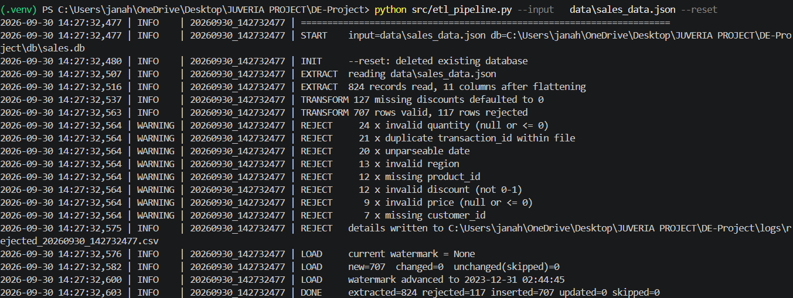
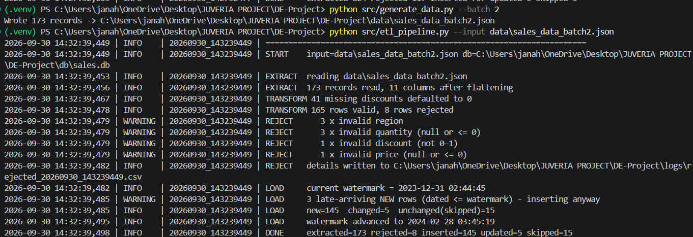
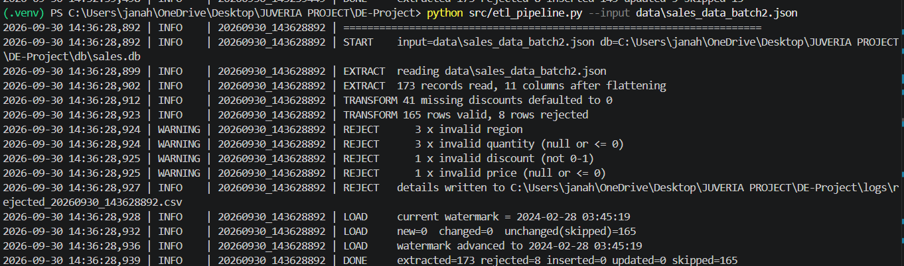
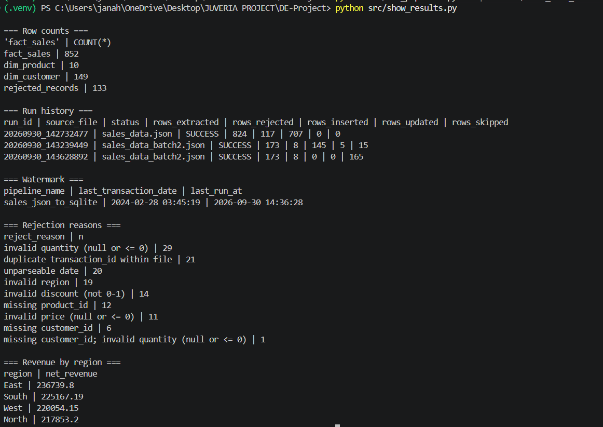
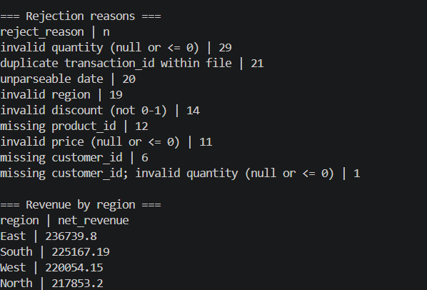
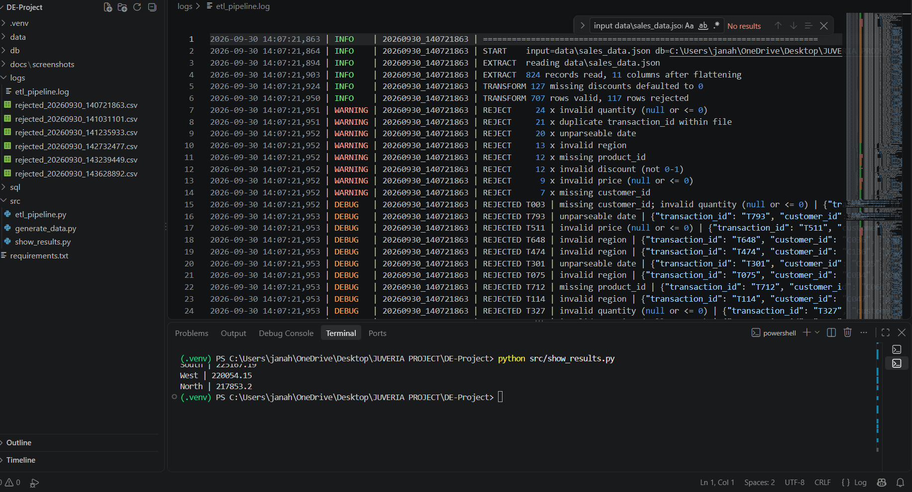
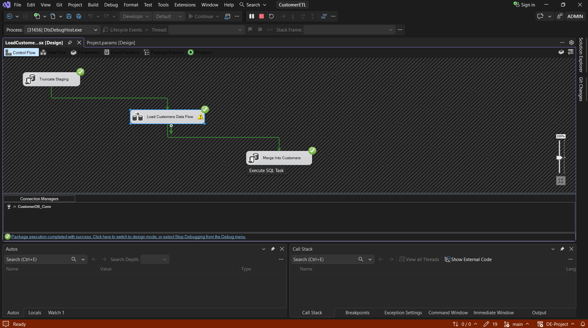
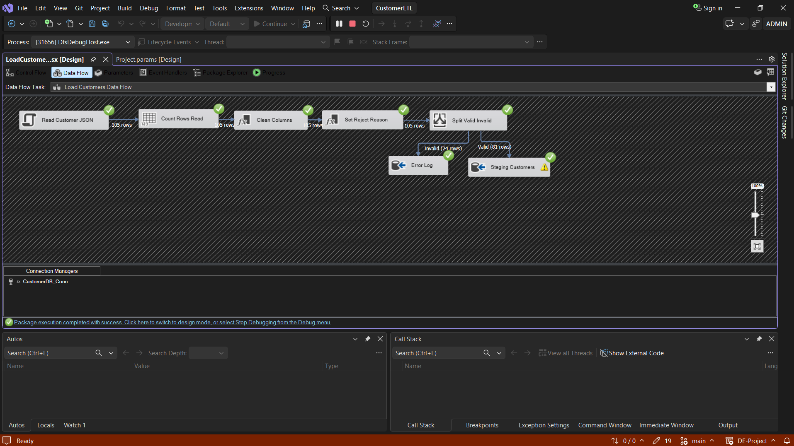
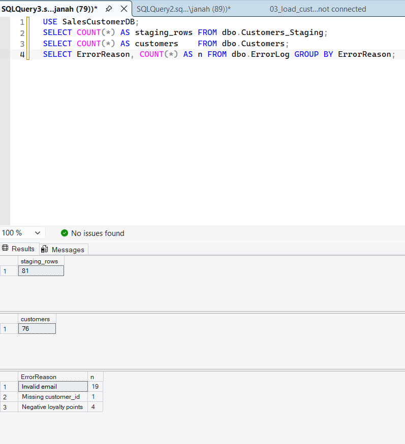

This project is my assignment submission to demonstrate below capabilities:

1) Generating synthetic data from sample records for sales transactions with customer and product details. [Technical components: Python, JSON]
2) Create Data ingestion process with incremental loads (watermarks) with error handling to ensure errored source records are captured (A Data quality framework - built into the ingestion pipelines). [Technical Components: Python, SQlite]
3) Processes sales transactions from JSON with Python and customer data with SSIS loading to SQL Server, where the customer pipeline and reporting warehouse are available together. [Technical Components: SSIS, SQL Server and Microsoft ODBC Driver, Visual Studio]
4) Create Power BI Reports with focus only Sales and Customer data. [Power BI]

## Project structure

 Path : Purpose 
-  **`data/sales_data.json` :** Generated sales batch 1 (824 records) 
-  **`data/sales_data_batch2.json` :** Incremental sales batch 2 (173 records) 
-  **`src/etl_pipeline.py` :** Python sales ETL into SQLite 
-  **`src/generate_data.py` :** Generates test batches from the supplied sample data
-  **`src/sync_sqlite_to_sqlserver.py` :** Daily publication from SQLite to the SQL Server warehouse
-  **`src/show_results.py` :** Shows SQLite row counts, run history and summary results
-  **`src/run_part2.py`:**  Runs the Part 2 SQLite queries
-  **`src/benchmark_indexes.py` :** Compares query timings with different index sets
-  **`sql/schema_sqlite.sql` :** SQLite sales schema
-  **`sql/part2/` :** Analytical views, indexes and query scripts
-  **`sql/03_ssis_tables_sqlserver.sql` :** SQL Server database and SSIS customer tables
-  **`sql/04_warehouse_sqlserver.sql` :** Shared SQL Server dimensions, fact table, audit and retention procedure
-  **`ssis/CustomerETL/` :** SSIS solution and `LoadCustomers.dtsx` package
-  **`/SalesCustomerDashboard03OCT26.pbix` :** Power BI dashboard
-  **`docs/part2_sample_output.md` :** SQL queries, sample results and query plans
-  **`docs/part2_design_and_indexing.md` :** Schema and index design notes
-  **`docs/screenshots/`, `Screenshots/`:**  Python, SSIS and PBI screenshots
-  **`logs/` :** ETL log and rejected-row files from sample runs
-  **`tests/` :** Unit tests for product change detection 

## Technical Architecture Requirements

- Python 3.10 or later and the packages in `requirements.txt`
- SQLite, included with Python
- SQL Server and Microsoft ODBC Driver 18 for SQL Server for warehouse publishing
- For SSIS: Windows, Visual Studio with the SSIS Projects extension, and SQL Server
- Power BI Desktop to open the dashboard

## Run the Python sales pipeline

From the repository root:

```bash
python -m venv .venv
```

Activate the environment and install the packages:

```bash
# Windows PowerShell
.venv\Scripts\Activate.ps1

pip install -r requirements.txt
```

**Creating Synthesized data in batches:** Generate the sample data, run both sales batches, then run the Part 2 queries:

```bash
python src/generate_data.py --batch 1
python src/etl_pipeline.py --input data/sales_data.json --reset
python src/generate_data.py --batch 2
python src/etl_pipeline.py --input data/sales_data_batch2.json
python src/show_results.py
python src/run_part2.py
```

The Python sales pipeline uses SQLite and applies `sql/schema_sqlite.sql` when it initializes `db/sales.db`. `--reset` starts a clean initial load; **Note**: This needs to be omitted it for incremental runs.

## Shared SQL Server warehouse

- The warehouse lives in SQL Server `SalesCustomerDB`.
- SSIS loads customer attributes from JSON into `dbo.Customers` and then refreshes the conformed `dbo.DimCustomer`.
- The daily sales publish reads the SQLite `dim_customer`, `dim_product` and `fact_sales` tables and upserts them into SQL Server `dbo.DimCustomer`, `dbo.DimProduct` and `dbo.FactSales`.
- The fact table has a primary key on `TransactionID` and foreign keys to `DimCustomer.CustomerID` and `DimProduct.ProductID`.
- Product and customer IDs are primary keys in their dimension tables.
- Sales-only customer IDs are inserted into `DimCustomer` with descriptive fields left NULL; a later SSIS customer load fills those attributes. This keeps the sales fact load valid when the customer source does not yet contain every sales ID.
- A daily publish happens from SQLite to SQL Server. This ensures SQL Server warehouse be the shared reporting store.
- For the current test data, the publisher reads a full snapshot each day and inserts new rows or updates facts whose row hash changed. This way even if a re-running is done - it is safe.


**Note:** As the data size is small, I have considered this design pattern where a full scan is warranted. If a larger scale data refresh is to be done, we can consider a source change watermark or CDC and retain the same idempotent keys.

### Create the SQL Server warehouse

Run these scripts in order in SSMS:

```text
sql/03_ssis_tables_sqlserver.sql
sql/04_warehouse_sqlserver.sql
```

**Note:** Set the connection string outside the repository as a mandatory step.

On run, 
1) load sales JSON into SQLite and load customer JSON through SSIS, then publish sales. Sales-only IDs are created as dimension rows automatically.
2) Schedule the source loaders and `python src/sync_sqlite_to_sqlserver.py` once a day using Task Scheduler or an equivalent scheduler.
3) Run the publisher after the SQLite sales load.
4) `dbo.WarehouseLoadRun` records each run, row counts and its outcome.
5) A failed publish rolls back the warehouse changes and records the failed run; the next run can safely retry.

**Part 1: Python sales ETL**

### Transformations and validation

The pipeline reads the nested `product` object and flattens its fields. It trims text, standardizes IDs and regions, parses the supported date formats, and calculates gross, discount and net amounts. A null discount is treated as zero. The date `03-05-2023` is interpreted as March 5, 2023 (MM-DD-YYYY).

Rows are rejected when 
- required IDs are missing,
- price or quantity is not positive,
- discount is outside 0–1,
- the date cannot be parsed,
- the region is invalid,
- transaction ID is duplicated within an input file.

All rejection reasons and source rows are retained for review. E,g., T003 is rejected because its customer ID is missing and quantity is negative.

### Incremental load

The pipeline compares transaction IDs and a SHA-256 hash of the business fields with rows already in `fact_sales`:

- **New transaction ID:** insert the transaction.
- **Existing ID with changed hash:** update the transaction.
- **Existing ID with the same hash**: skip it.

**Other Key considerations made in the data ingestion to support incremental load requirements**
- Late arriving transactions are logged and inserted even when their date is earlier than the current watermark.
- The hash includes customer ID, product ID, product name, product category, quantity, price, discount, date and region.
- The fields are serialized as JSON before hashing to avoid separator collisions. A product rename or category change therefore triggers a fact update and refreshes the SQLite product dimension.
- Loads are committed in a database transaction.
- Re-running an unchanged batch is idempotent.
- Rejected records are logged on each run, so rerunning a batch can add another rejection audit entry for the same source row.


**The final sample SQLite database contains 852 sales rows, 10 products and 149 customers.** The rejected-record count includes rejections recorded from all three runs.

**Part 2: Database design and SQL**

1)  `sql/schema_sqlite.sql` defines the local sales schema.
2)  Its main tables are `fact_sales`, `dim_product` and `dim_customer`.
3)  The fact table has a transaction primary key and customer/product foreign keys. Product and customer attributes are stored separately.
4)  Derived gross, discount and net amounts are retained on fact rows for reporting and indexing.
5)  `sql/part2/03_queries.sql` covers sales by region and category, top five products, monthly sales, average discount by region, and transactions over $1,000.
6)  Index choices and benchmark measurements are in [`docs/part2_design_and_indexing.md`](docs/part2_design_and_indexing.md).
7)  For review, example outputs along with explain query plans are in [`docs/part2_sample_output.md`](docs/part2_sample_output.md).  Given the size and cardinality of the data model, explain plans are optimal.
8)  The shared SQL Server schema is in `sql/04_warehouse_sqlserver.sql`. The SQL Server query variant expects those warehouse tables; the primary analytical query scripts and sample outputs use SQLite.

**Part 3: SSIS customer pipeline**

The SSIS package reads `data/customer_data.json`, validates and transforms customer records, writes valid rows to a staging table, and merges them into `dbo.Customers`. It then updates the shared `dbo.DimCustomer`. Rejected rows go to `dbo.ErrorLog`.

### Run the package

1. Run `sql/03_ssis_tables_sqlserver.sql` and `sql/04_warehouse_sqlserver.sql` in SSMS.
2. Open `ssis/CustomerETL/CustomerETL.slnx` in Visual Studio with the SSIS Projects extension.
3. Set `ServerName`, `DatabaseName` and `SourceFilePath` in `Project.params`. Set `SourceFilePath` to the full path of this repository's `data/customer_data.json`; the checked-in default path is machine-specific.
4. Open the `Read Customer JSON` Script Component once in the SSIS script editor, save/build its script, then rebuild and run `LoadCustomers.dtsx`. The embedded script source and output metadata changed, so Visual Studio must regenerate the compiled Script Component assembly.
5. Verify row counts and audit records in SQL Server.
6. The package uses Windows authentication through its project connection expression.
7. All of the rejected rows are written to `dbo.ErrorLog`.

### Data flow and validation

The control flow clears `Customers_Staging`, runs a Data Flow Task, then merges staged rows into `Customers` and updates `DimCustomer`. The data flow uses a C# Script Component as the JSON source, a Row Count, Derived Column transformations and a Conditional Split.

 Input condition :- Package action 

- Missing or blank customer ID :- Reject to `ErrorLog`
- Negative loyalty points :- Reject to `ErrorLog'
- Loyalty points is a string, fractional number or outside the integer range :- Reject to `ErrorLog`
- JSON null or missing loyalty points :- Default to 0
- Malformed or overlength email :- Reject to `ErrorLog`
- Null or blank name/region :- Set to `Unknown`
- Null or blank email :- Load as NULL
- Unparseable join date :- Load as NULL
- Duplicate customer ID :- Keep the last occurrence in the current run
- For `loyalty_points`- Only an integer JSON number is accepted. A malformed string or fractional value is routed to the reject flow before the null-to-zero default can run.

The sample run reads 105 rows: 24 are rejected (19 invalid emails, 4 negative loyalty values and 1 missing customer ID). The remaining 81 rows are staged, then de-duplicated to 76 customers.


### Run and retention conditions

1) The Script Component creates one timestamp-prefixed run ID per data-flow execution and writes it to every staging row and rejected audit row as `RunID`.
2) The timestamp prefix lets the merge select the latest run if a checkpoint restart leaves partial rows from a failed attempt.
3) The merge reads only the current staged run.
4) The package clears staging before each execution. Staging is operational data and is not kept as history.
5) `ErrorLog` rows are retained for 90 days.
6)`dbo.PurgeCustomerEtlAudit` from `sql/04_warehouse_sqlserver.sql` run as a daily SQL Server Agent job. The procedure removes any staging rows older than seven days.

**Note:** 
- SSIS checkpoint path configured as `C:\SSISData\LoadCustomers.chk` that needs to be changed to the path where to the path of machine where the package is running. This will be scaled to a configurable version when scaled to production. For ease of development, have put the local config path.
- `sql/03_load_customers_fallback.sql` applies the customer validation and merge with SQL Server `OPENJSON`. Set the JSON file path in the script before running it.


**Part 4: Power BI dashboard**

The report contains these visuals:

- Total sales by region
- Monthly sales trend
- Top five products by revenue
- Total Customers and Average Sale per Transaction KPI cards
- Loyalty points distribution by region


 Measures created and calculation 
-  **Total Sales:**   Sum of transaction net amounts
-  **Average Sale per Transaction:**  Total sales divided by the distinct transaction count
-  **Total Loyalty Points:**  Sum of customer loyalty points
-  **High-Value Transactions:**  Count of transactions where net amount is greater than 1,000
-  **Sales YTD:**  Total sales from the start of the year through the selected date |

**Part 5: Documentation & Screenshots**

The Python sales pipeline writes stage summaries and validation messages to `logs/etl_pipeline.log`. It also writes rejected rows to `logs/rejected_<run_id>.csv`. SSIS rejects are stored in SQL Server `dbo.ErrorLog` with `RunID`.



















<<>TODO: Take PBI Screenshots - add to the path and include here.>

## Error Handling and Logs

- The Python ETL rejects invalid sales rows with reasons, saves them to a run-specific CSV, and records processing errors and stack traces in the [ETL log](logs/etl_pipeline.log).E.g.,  [rejected sales rows](logs/rejected_20260930_140721863.csv).
- Each database load runs in a transaction; on failure, changes are rolled back and the run is marked failed.
- SSIS routes invalid customer rows to SQL Server’s `dbo.ErrorLog`, including the run ID, source row, raw record, and rejection reason; package task failures stop the run.
- SSIS clears staging before a new run and retains error records for 90 days; see the [SQL Server table and retention scripts](sql/04_warehouse_sqlserver.sql).
- In SSIS used checkpoints to restart at task boundaries. Also review of staging and the run-specific error records before resuming after a partial data-flow failure is done.

## Challenges faced

1) Synthetic data quality: The first generated dataset was skewed, which I found during exploratory data analysis. I regenerated the batches from the supplied sample records so the distribution across regions, products and customers was more realistic. I also added a second incremental batch to test inserts, updates and late-arriving transactions.
2) Choice of landing store: I first considered a medallion design: land the data in ADLS Gen2, standardize it to support incremental loads, then load a gold layer in SQL Server using SSIS. Since all sources are small, structured JSON files, I moved away from that approach and used SQLite for the Python pipeline to keep execution and cost lightweight. A daily publish then loads SQL Server as the shared reporting store.
3) SSIS setup: SSIS has no native JSON source, so I built the source with a C# Script Component. Changes to its script and output metadata required regenerating the compiled assembly in Visual Studio. I also had to handle machine-specific settings (source file path, checkpoint path, Windows authentication) and make sure rejected customer rows flow to `dbo.ErrorLog` with a run ID.
4) Power BI connectivity: I used Power BI Desktop standalone, so the data is imported into the PBIX. In production, I would use a composite model: Import mode for dimensions and DirectQuery for the sales fact table.

## Production improvements

1) Current design is a daily full snapshot load. This is expensive and should be replaced with change tracking or CDC when the sales volume grow.
2) No secrets and environment-specific paths outside source control are considered. In the enterprise infosec standards and routine scans - this will be a potential vulnerability. Need to scale this before deploying to production as per enteprise standards.
3) Use SQL Server Agent or enterprise orchestrator to schedule the SSIS package and integrate the enteprise logging/ observability with monitoring and failure alerts.
4) In Power BI report, only Customer Dimension is imported. Given the project scope - 'PRODUCT' data is not imported. This needs to be scaled. 
